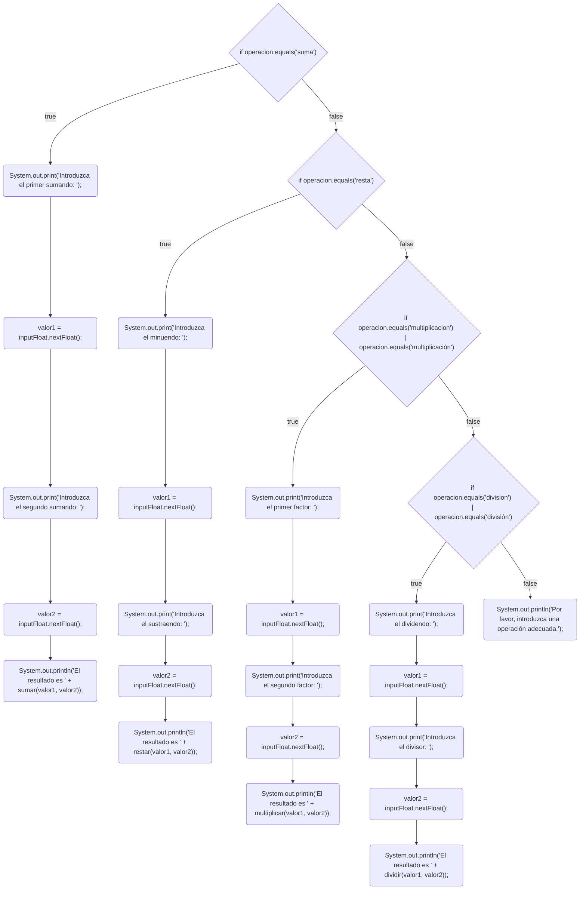

## Ejercicios semana 5 programación
* [Ejercicio 1](src/semana5/Ejercicio1.java)
* [Ejercicio 2](src/semana5/Ejercicio2.java)
* [Ejercicio 3](src/semana5/Ejercicio3.java)
* [Ejercicio 4](src/semana5/Ejercicio4.java)
* [Ejercicio 5](src/semana5/Ejercicio5.java)
* [Ejercicio 6](src/semana5/Ejercicio6.java)

Diagrama Ejercicio 6

